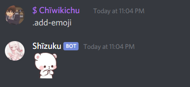

# $addEmoji
> **This function takes care of automatically adding an emoji to the server using the provided URL.**
#### Note

The URL of the original image must be under 256kb in size.

## Fields:
|field|type|description|optional|default value|
|-----|----|-----------|--------|-------------|
|**guildID**|**Snowflake**|The guild where the emoji will be added|false|-|
|**Url**|**string**|url of emoji to be added|false|-|
|**name**|**string**|name of the emoji|false|-|
|**returnEmoji?**|**yes**\|**no**|return the emoji after adding it|true|no|
|**reason?**|**string**|why the emoji was added|true|-|
|**roleId?**|**Snowflake**\|**Array\<Snowflake\>**|role that can use the emoji|true|-|
## Usage
>```
> $addEmoji[guildId;Name;url;returnEmoji?;reason?;roleId;roleId;...]
>```
## Example 
>```javascript
>bot.command({
>    name: "add-emoji",
>    code: `$addEmoji[$guildID;shy_bear;https://cdn.discordapp.com/emojis/786763619438166036.png;yes]`
>});
>```
### Result:
> 
#### Note

URL NEEDS to end in `.gif`, `.png` or `.jpg`


